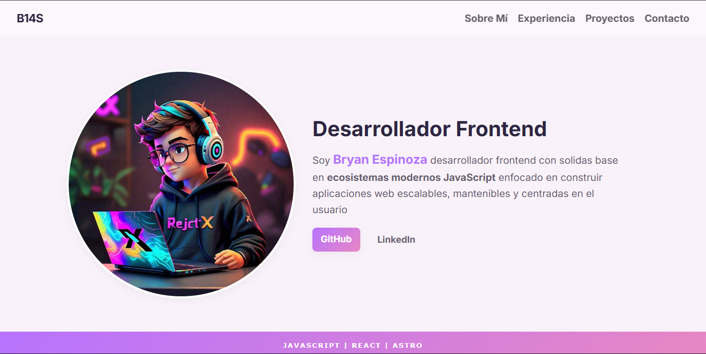

# Landing Page - 14BryanEspinoza

## 🚀 Descripción del Proyecto

El sitio funciona como la carta de presentación oficial de **Bryan Espinoza**, integrando:

- **Diseño Premium**: Uso de **Glassmorphism**, gradientes armónicos y tipografía moderna (Google Fonts).
- **Sección de Experiencia**: Línea de tiempo detallada con formación académica y trayectoria profesional.
- **Sección de Proyectos**: Galería de proyectos destacados con tarjetas interactivas.
- **Micro-interacciones**: Transiciones suaves y efectos hover que mejoran la experiencia de usuario (UX).
- **Optimización Mobile-First**: Layout totalmente responsivo y adaptado para dispositivos táctiles.

## 🛠️ Tecnologías y Metodologías

- **HTML5**: Estructura semántica avanzada para SEO y accesibilidad.
- **CSS3 Puro**:
  - **Variables CSS**: Sistema de diseño centralizado para colores, espacios y fuentes.
  - **Flexbox & Grid**: Layouts robustos y modernos sin frameworks externos.
  - **BEM Methodology**: Nomenclatura de clases estricta (`bloque__elemento--modificador`) para un CSS mantenibles.
- **Git & GitHub**: Control de versiones y despliegue continuo.

## 📱 Vista Previa

A continuación se muestra una referencia visual del diseño actual:

## 🔗 Enlace al Proyecto

- **Sitio en vivo**: [Ver Portfolio](https://landingpage14bz.netlify.app/)

## 📈 Estado y Evolución

El proyecto se encuentra en un estado funcional avanzado, cumpliendo los requisitos de:

- [x] Diseño Responsivo (Mobile, Tablet, Desktop).
- [x] Accesibilidad Web básica.

**Próximos Pasos**:

- Integración de animaciones de entrada con Scroll Reveal (manteniendo CSS puro).
- Implementación de un modo oscuro (Dark Mode) mediante variables CSS dinámicas.
- Optimización de imágenes de proyectos mediante formatos de nueva generación (WebP).

### Desarrollado por Bryan Espinoza - 2026
